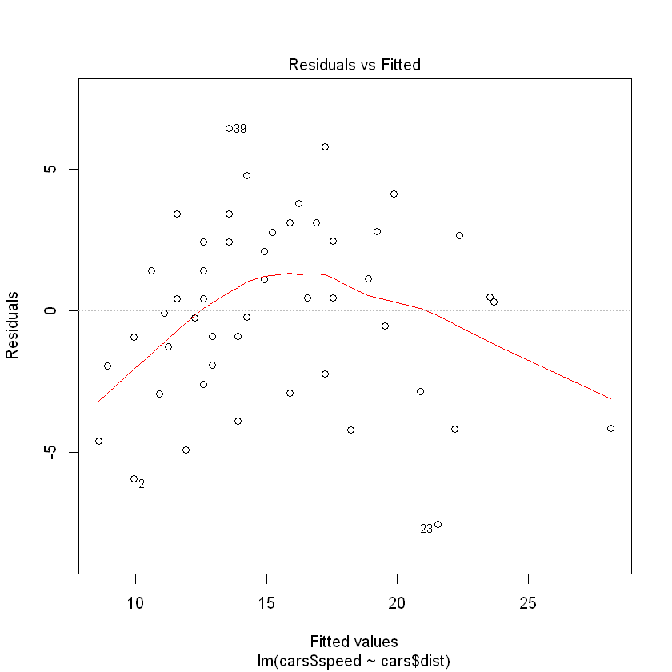
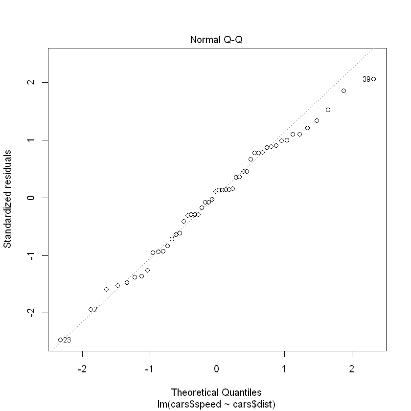
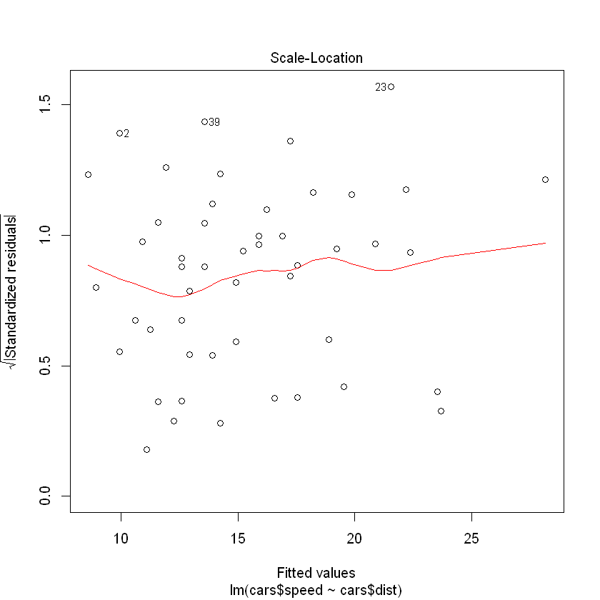
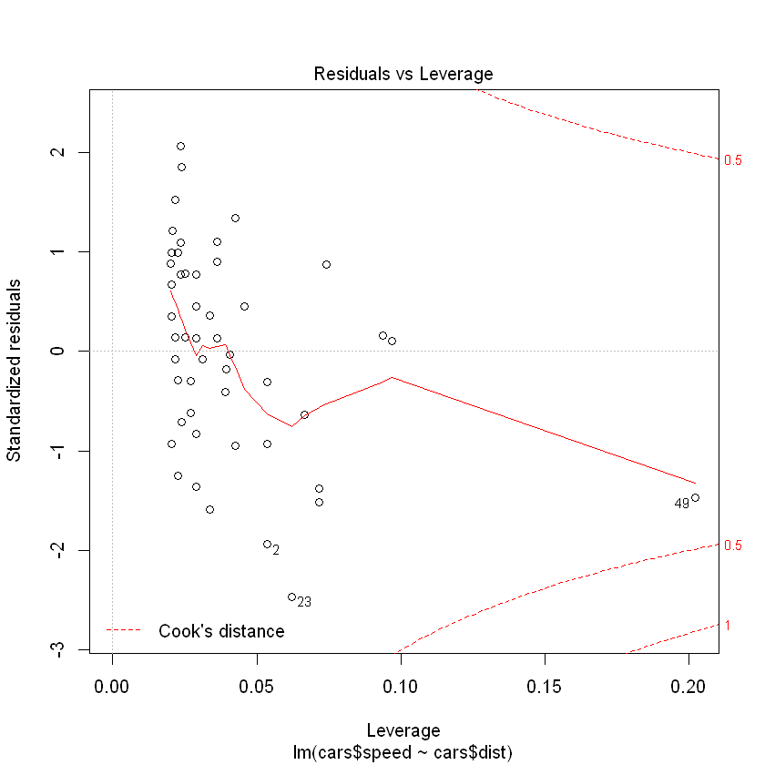

# RUserGroupCourse
## curso R
cositas que ya conocia
```R
data(cars)
```

## graficos


```R
summary(cars)
```


         speed           dist       
     Min.   : 4.0   Min.   :  2.00  
     1st Qu.:12.0   1st Qu.: 26.00  
     Median :15.0   Median : 36.00  
     Mean   :15.4   Mean   : 42.98  
     3rd Qu.:19.0   3rd Qu.: 56.00  
     Max.   :25.0   Max.   :120.00  


```R
head(cars)
```


<table>
<thead><tr><th scope=col>speed</th><th scope=col>dist</th></tr></thead>
<tbody>
	<tr><td>4 </td><td> 2</td></tr>
	<tr><td>4 </td><td>10</td></tr>
	<tr><td>7 </td><td> 4</td></tr>
	<tr><td>7 </td><td>22</td></tr>
	<tr><td>8 </td><td>16</td></tr>
	<tr><td>9 </td><td>10</td></tr>
</tbody>
</table>


```R
ml<-lm(cars$speed~cars$dist)
```


```R
plot(ml)
```













